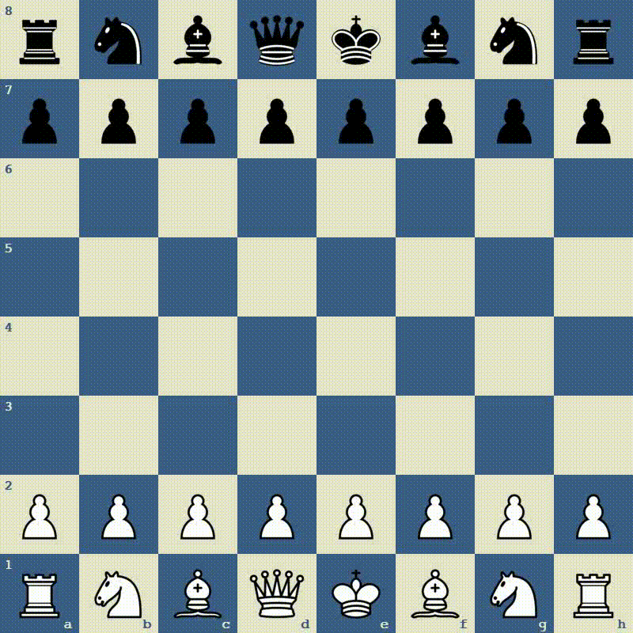

# Chess Grandmaster AI

Chess Grandmaster AI offers an immersive chess experience, challenging players with state-of-the-art AI opponents and showcasing strategic battles between AI contenders. Built with Pygame for a compelling graphical interface, the project features diverse AI strategies—Minimax, Alpha-Beta Pruning, and Expectimax—designed to emulate the intricate tactics and foresight of a chess grandmaster.

## Features

- **Player vs. AI Mode**: Test your chess skills against a computer opponent.
- **AI vs. AI Mode**: Watch two AI agents compete in a chess match.
- **Customizable Difficulty**: Adjust the AI's depth of search to set the difficulty level.
- **Graphical User Interface**: A fully interactive and visually engaging board to play on, powered by Pygame.

## Installation

To set up Chess Grandmaster AI on your local machine, follow these steps:

1. **Clone the repository**

```bash
git clone https://github.com/MohammadH915/Chess-Grandmaster-AI.git
cd Chess-Grandmaster-AI
```

2. **Create a virtual environment (optional but recommended)**

```bash
python -m venv venv
source venv/bin/activate  # On Windows use `venv\Scripts\activate`
```

3. **Install dependencies**

```bash
pip install -r requirements.txt
```

## Usage

To start the game, run the following command in your terminal:

```bash
python src/main.py
```

### Command Line Arguments

- `-af`, `--main-agent`: Specify the main AI agent (Default: RandomAgent, Choices: [RandomAgent, MinimaxAgent, AlphaBetaAgent, ExpectimaxAgent]).
- `-as`, `--second-agent`: Specify the second AI agent for AI vs. AI mode (Default: RandomAgent, Choices: [RandomAgent, MinimaxAgent, AlphaBetaAgent, ExpectimaxAgent]).
- `-df`, `--main-agent-depth`: Set the search depth for the main AI agent (Default: 2).
- `-ds`, `--second-agent-depth`: Set the search depth for the second AI agent (Default: 2).
- `-p`, `--play-type`: Choose between Player vs. Bot (`PlayerVsBot`) and Bot vs. Bot (`BotVsBot`) modes (Default: PlayerVsBot).

Example to start an AI vs. AI game:

```bash
python src/main.py -p BotVsBot
```

## AI Methods

### Minimax

The Minimax algorithm is crucial for two-player turn-based games. It aims to minimize the potential loss for a worst-case (maximum loss) scenario. When implementing this strategy, the algorithm explores all possible moves, predicts the opponent's response to each move, and selects the move that maximizes the player's minimum gain. The game's possible outcomes are represented in a tree structure, with each node corresponding to a game state.

### Alpha-Beta Pruning

Alpha-Beta Pruning is an optimization of the Minimax algorithm. It reduces the number of nodes evaluated in the search tree by pruning branches that cannot possibly influence the final decision. This significantly improves the algorithm's efficiency, allowing it to search deeper in the same amount of time.

### Expectimax

The Expectimax algorithm extends Minimax to handle games with elements of chance, representing the opponent's moves as stochastic events. Unlike Minimax, which assumes an opponent will always make the best possible move, Expectimax allows for the evaluation of moves in situations where the opponent's response or the outcome of a move is uncertain.


## License

This project is licensed under the [MIT License](LICENSE).

## Acknowledgments

- **Chess Engine**: This project uses [python-chess](https://python-chess.readthedocs.io/en/latest/) for managing chess game logic.
- **GUI**: The graphical interface is powered by [Pygame](https://www.pygame.org/news).

---
## Results
AlphaBetaAgent Vs AlphaBetaAgent
<div align="center">
    
</div>
